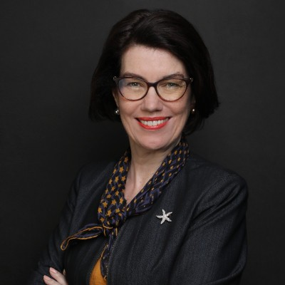
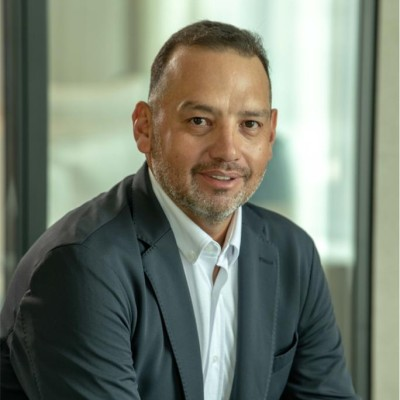
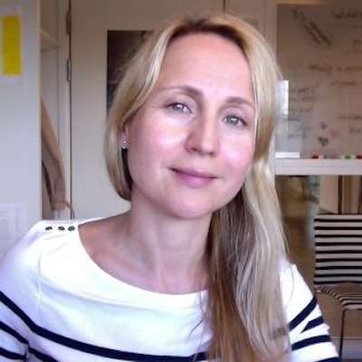

# Advisory Board of ExCom AI

The Advisory Board of ExCom AI is a strategic asset providing guidance in areas like legal compliance, market expansion, technological innovation, and financial strategy. By leveraging each member's unique expertise and regional knowledge, ExCom AI stays competitive and responsive to global markets.

## Board Members

|                                                                                  |                                                                            |                                                                       |
| -------------------------------------------------------------------------------- | -------------------------------------------------------------------------- | --------------------------------------------------------------------- |
|  **Anneliese Reinhold** 🇦🇺 "The Guardian" |  **Peter Larnholt** 🇸🇪 "The Tech Visionary" |  **Fabio Mando**🇮🇹 "The Bank"      |
|  **Diego Camberos** 🇧🇴 "The Commercial"      |  **Despo Michailides** 🇿🇦🇨🇾 "The People Hero"  |  **Dina Koutsikouri**🇬🇷 "The Researcher" |
|  **Richard Guest** 🇬🇧 "The Globalist"   |  **Neil Gupta** 🇮🇳 "The Investor"    |  **Nelson Bolanos**🇸🇻 "Wilson"  |

### Member Details

| Name                | Title             | Region     | Email                | Focus                            | Responsibilities                                                                             | LinkedIn                                                       |
| ------------------- | ----------------- | ---------- | -------------------- | -------------------------------- | -------------------------------------------------------------------------------------------- | -------------------------------------------------------------- |
| Anneliese Reinhold  | The Guardian      | Australia  | anneliese@excom.ai   | Legal Compliance                 | Overseeing legal compliance, risk management, ethical conduct                                | [Profile](https://www.linkedin.com/in/anneliesereinhold/)      |
| Diego Camberos      | The Commercial    | Bolivia    | diego@excom.ai       | Sales Expansion                  | Developing sales strategies, market expansion                                                | [Profile](https://www.linkedin.com/in/diego-camberos-0438274/) |
| Richard Guest       | The Globalist     | UK         | richard@excom.ai     | International Business           | Managing international operations                                                            | [Profile](https://ae.linkedin.com/in/richardcguest)            |
| Dina Koutsikouri    | The Researcher    | Greece     | dina@excom.ai        | Research Insights                | Providing industry research and analysis                                                     | [Profile](https://www.linkedin.com/in/dina-koutsikouri-1859a012/) |
| Peter Larnholt      | The Tech Visionary | Sweden     | peter@excom.ai       | Technological Innovation         | Leading tech initiatives, fostering innovation                                               | [Profile](https://www.linkedin.com/in/larnholt/)               |
| Despo Michailides   | The People Hero   | South Africa | despo@excom.ai      | Customer & Employee Satisfaction | Advocating for people interests, improving engagement                                         | [Profile](https://www.linkedin.com/in/despo-michaelides-16384519) |
| Neil Gupta          | The Investor      | India      | niel@excom.ai        | Investment Strategies            | Advising on investments and growth opportunities                                             | [Profile](https://www.linkedin.com/in/neil1401/)               |
| Fabio Mando         | The Bank          | Italy      | fabio@excom.ai       | Financial Strategy               | Managing capital allocation and financial planning                                            | [Profile](https://www.linkedin.com/in/fabiomando/)             |

## Executive Management

| Name                | Role | Focus                 | Responsibilities                                                                                       | LinkedIn                                  |
| ------------------- | ---- | --------------------- | ------------------------------------------------------------------------------------------------------ | ----------------------------------------- |
| Nelson Bolaños      | COO  | Operations            | Oversee daily operations, ensure efficiency                                                            | [Profile](https://www.linkedin.com/in/nbolanoss/) |
| Nelson Bolaños      | CTO  | Technology            | Lead technology strategy and planning                                                                  | [Profile](https://www.linkedin.com/in/nbolanoss/) |
| *Vacant*            | CFO  | Financial Oversight   | Manage finances, financial planning, risk